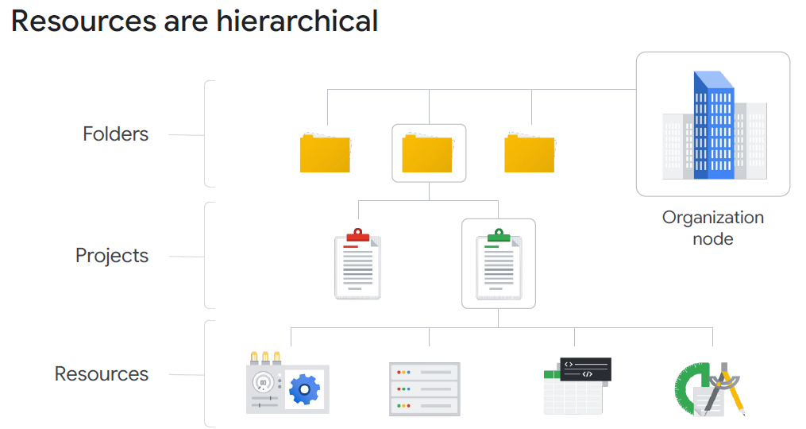
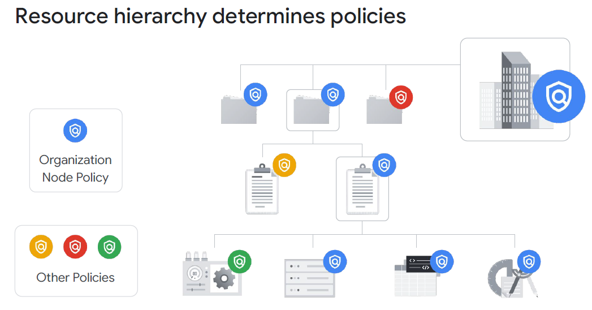
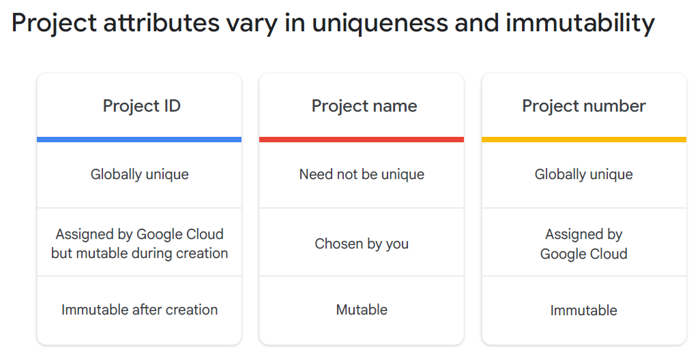
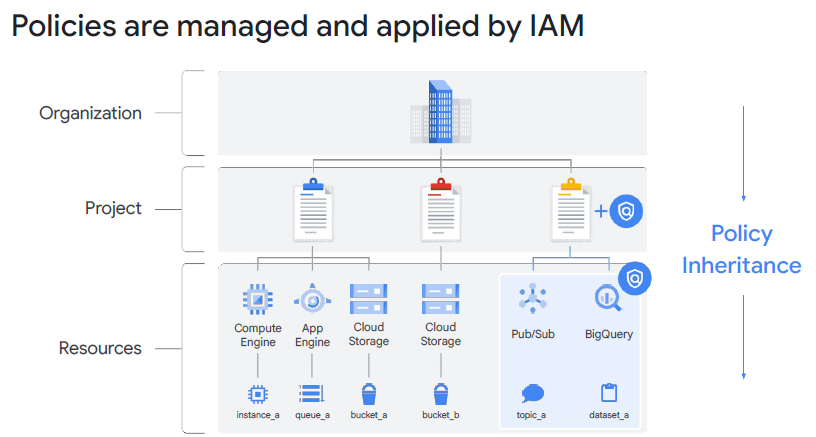
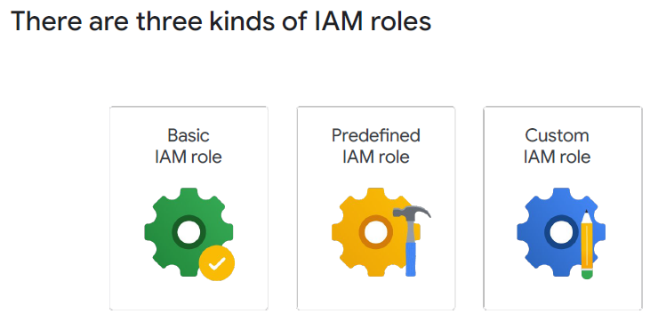
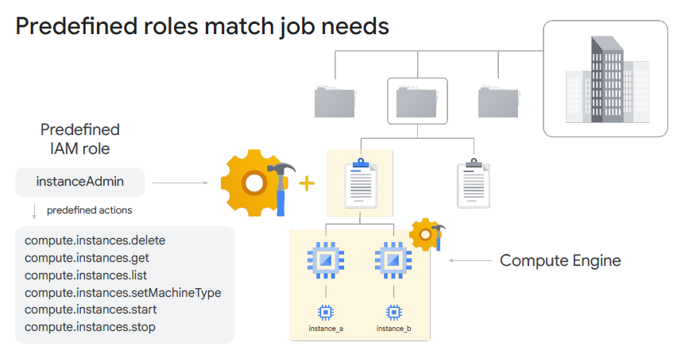
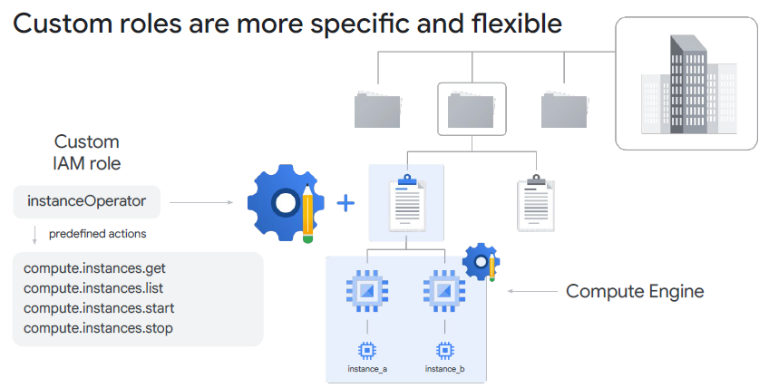
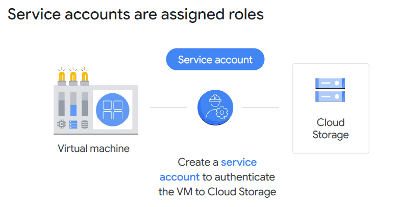
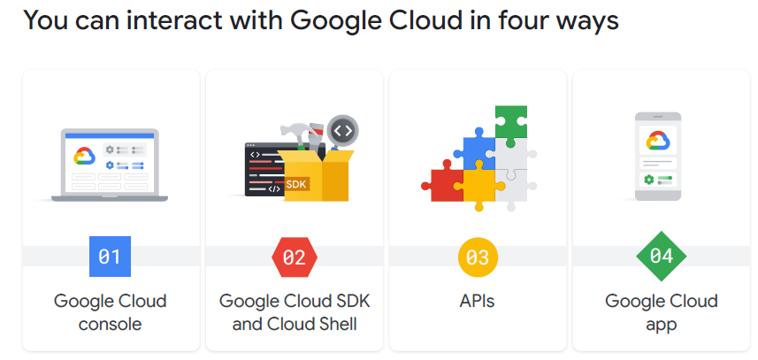

# Module 2: Resource Hierarchy & IAM

## Status: ✅ Completed (Day 1 · 2026.04.08)

## 🔗 Quick Navigation

- Q&A Review: [qa-review.md](qa-review.md)

---

## 📝 Learning Objectives

By the end of this module, you will understand:

- [x] Google Cloud's resource hierarchy: Resources → Projects → Folders → Organization
- [x] How policies inherit downward through the hierarchy
- [x] The three Project identifiers and their mutability
- [x] The difference between IAM Policies and Organization Policies
- [x] The three types of IAM roles and the principle of least privilege
- [x] Service accounts and how applications authenticate to GCP APIs
- [x] Cloud Identity for employee identity management
- [x] The four methods for interacting with Google Cloud

---

## 📚 Key Concepts

### 1. Resource Hierarchy

Google Cloud resources are organized in a 4-level hierarchy:

```
Organization (company domain)
    └── Folders (departments, teams, environments)
            └── Projects (isolated billing & management units)
                    └── Resources (VMs, buckets, databases, etc.)
```

| Level            | Description                                                                                             | Example                                                     |
|------------------|---------------------------------------------------------------------------------------------------------|-------------------------------------------------------------|
| **Organization** | Root node; represents the company domain; managed via Cloud Identity or Google Workspace                | `acmecorp.com`                                              |
| **Folder**       | Optional grouping layer; used for departments, teams, or environments; can be nested                    | `Finance`, `Engineering`, `Production`                      |
| **Project**      | Primary unit of resource management; all resources belong to exactly one project; isolated billing unit | `my-web-app-prod`                                           |
| **Resource**     | Individual GCP services and objects                                                                     | Compute Engine VM, Cloud Storage bucket, Cloud SQL instance |

**Key Properties:**
- Every resource belongs to exactly **one project**
- Projects belong to exactly **one parent** (folder or organization)
- Folders can be **nested** (folder within folder)
- The organization node requires **Cloud Identity or Google Workspace**



---

### 2. Policy Inheritance

Policies applied at a higher level **inherit downward** through the entire subtree.

```
Organization Policy
    └── Folder Policy (inherits + can add restrictions)
            └── Project Policy (inherits + can add restrictions)
                    └── Resource Policy (inherits)
```

**Policy Inheritance Rules:**
- A **more permissive** policy at a higher level **takes effect** even if a lower-level policy is restrictive (for IAM)
- **Organization Policies** (constraints) are additive — restrictions at higher levels propagate down and cannot be overridden at lower levels
- You **cannot** grant more permissions at a lower level than what is denied by Organization Policy constraints

**Deny Policies (Important!):**
- IAM also supports **explicit deny rules** that prevent specific principals from using certain permissions
- Deny policies are checked **before** allow policies — a deny always overrides any existing allow
- Deny policies also inherit downward through the resource hierarchy

**Resource Manager Tool:**
- A programmatic API (RPC and REST) for managing projects at scale
- Capabilities: create projects, list all projects, update projects, delete projects, **recover previously deleted projects**
- Useful for automation scripts and CI/CD pipelines that need to provision new project environments

**Example:**
- If the Organization has an IAM binding granting Alice `Owner` on the org, Alice has Owner access to all projects/resources under that org — even if a project policy doesn't explicitly grant it



---

### 3. Project Identifiers

Every GCP project has **three identifiers**:

| Identifier         | Assigned By            | Mutable?                 | Format                                                | Use                        |
|--------------------|------------------------|--------------------------|-------------------------------------------------------|----------------------------|
| **Project Number** | Google (auto-assigned) | Immutable                | Numeric (e.g., `123456789012`)                        | Internal Google systems    |
| **Project ID**     | User (at creation)     | Immutable after creation | Globally unique string (e.g., `my-web-app-prod`)      | API calls, gcloud commands |
| **Project Name**   | User                   | Editable anytime         | Human-friendly string (e.g., `My Web App Production`) | Display in Console         |

> **Exam Tip:** Project **ID** and **Number** are both immutable. The **Name** is the only one you can change later. Project IDs must be **globally unique** across all of GCP — not just within your organization.



---

### 4. IAM Policies vs. Organization Policies

| Feature        | IAM Policy                                            | Organization Policy                                       |
|----------------|-------------------------------------------------------|-----------------------------------------------------------|
| **Controls**   | Who can do what on which resource (*identity-based*)  | What can be created or configured (*resource-based*)      |
| **Example**    | Grant Alice permission to create VMs in `project-a`   | Restrict all projects to only deploy VMs in `us-central1` |
| **Applies to** | Identities (users, groups, service accounts)          | Resources and configurations                              |
| **Managed by** | Project owners, IAM admins                            | Organization Policy Admin                                 |
| **Scope**      | Can be set at org, folder, project, or resource level | Set at org, folder, or project level                      |

---

### 5. IAM — Identity and Access Management

**Core Concept:** IAM controls "**who** can do **what** on **which resource**."

```
Principal (Who)  +  Role (What)  +  Resource (Which)  =  IAM Binding
```

**Components:**

| Component              | Description                             | Example                                                                                                  |
|------------------------|-----------------------------------------|----------------------------------------------------------------------------------------------------------|
| **Principal (Member)** | The identity to grant access to         | `user:alice@company.com`, `group:devs@company.com`, `serviceAccount:app@project.iam.gserviceaccount.com` |
| **Role**               | A collection of permissions             | `roles/compute.admin`                                                                                    |
| **Permission**         | Granular action allowed on a resource   | `compute.instances.create`                                                                               |
| **Policy**             | Binds principals to roles on a resource | JSON/YAML binding document                                                                               |

**Permission Naming Convention:** `service.resource.verb`
- `compute.instances.create` — create Compute Engine VM instances
- `storage.buckets.list` — list Cloud Storage buckets
- `bigquery.tables.get` — get BigQuery table metadata



---

### 6. IAM Role Types



| Role Type            | Description                                     | Scope                | When to Use                                             |
|----------------------|-------------------------------------------------|----------------------|---------------------------------------------------------|
| **Basic Roles**      | Broad legacy roles: `Owner`, `Editor`, `Viewer` | Entire project       | Dev/test environments only; too broad for production    |
| **Predefined Roles** | Curated, service-scoped roles defined by Google | Specific GCP service | Recommended for most use cases                          |
| **Custom Roles**     | User-defined set of permissions                 | Any combination      | When predefined roles are too permissive for your needs |

**Basic Role Details:**

| Role     | Permissions                                                                 |
|----------|-----------------------------------------------------------------------------|
| `Viewer` | Read-only access to all resources in the project                            |
| `Editor` | All Viewer permissions + create/modify resources (not delete or manage IAM) |
| `Owner`  | All Editor permissions + delete resources, manage billing, manage IAM       |

**Principle of Least Privilege:**
> Grant identities **only the permissions they need** to perform their job, and nothing more.

- Prefer **Predefined Roles** over Basic Roles in production
- Use **Custom Roles** when predefined roles grant excessive permissions
- Audit IAM policies regularly with **IAM Recommender**

> **Critical Limitation:** Custom roles can only be created at the **project** or **organization** level — NOT at the folder level. If you need a custom role available within a folder, define it at the organization level.

> **Exam Tip:** IAM role granularity order (broadest → finest): **Basic → Predefined → Custom**





> **Q: Why are Basic Roles generally discouraged in production environments?**
>
> **A:** Basic Roles (Owner, Editor, Viewer) apply broadly to **all resources in a project**. They violate least privilege by granting more access than most users need, increasing the blast radius if an account is compromised.

---

### 7. Service Accounts

**What they are:** Special Google accounts that represent **applications or VMs**, not humans. Used for machine-to-machine authentication.

| Property           | Description                                                        |
|--------------------|--------------------------------------------------------------------|
| **Identity**       | `name@PROJECT_ID.iam.gserviceaccount.com`                          |
| **Authentication** | Uses cryptographic keys (not passwords); managed by Google         |
| **Purpose**        | Allow applications to make authorized API calls to GCP services    |
| **Assignment**     | Attached to Compute Engine VMs, Cloud Run services, GKE pods, etc. |

**How It Works:**
1. Create a service account with a descriptive name
2. Grant the service account IAM roles with least privilege
3. Attach the service account to the resource (VM, Cloud Run service, etc.)
4. The application running on that resource automatically uses the service account identity



**Service Account as Both Identity and Resource:**
- As an **identity**: You can grant service accounts roles on resources (it acts as a principal)
- As a **resource**: You can grant users the ability to *use* (impersonate) a service account with `roles/iam.serviceAccountUser`

> **Exam Tip:** Never store service account key files in source code or containers. Prefer attaching service accounts directly to Compute Engine instances or Cloud Run services — keys are managed by Google automatically.

---

### 8. Cloud Identity & Employee Identities

**Cloud Identity:** Google's Identity as a Service (IDaaS) platform for managing employee accounts.

| Feature                         | Description                                                                                               |
|---------------------------------|-----------------------------------------------------------------------------------------------------------|
| **Managed accounts**            | Create user accounts under your domain (e.g., `alice@acmecorp.com`)                                       |
| **Directory sync**              | Sync user/group data from on-premises **Active Directory** or LDAP via Google Cloud Directory Sync (GCDS) |
| **Single Sign-On (SSO)**        | Federate with existing identity providers (Okta, Azure AD, ADFS)                                          |
| **Multi-Factor Authentication** | Enforce MFA for all users                                                                                 |
| **Free tier**                   | Cloud Identity has a free tier; Google Workspace adds productivity apps                                   |

**Identity Types in GCP:**

| Identity Type                      | Format                                               | Description                                        |
|------------------------------------|------------------------------------------------------|----------------------------------------------------|
| Google Account                     | `user:alice@gmail.com`                               | Personal Google account                            |
| Cloud Identity / Workspace Account | `user:alice@company.com`                             | Managed corporate account                          |
| Google Group                       | `group:team@company.com`                             | Collection of users; best practice for team access |
| Service Account                    | `serviceAccount:app@project.iam.gserviceaccount.com` | Application/workload identity                      |
| `allAuthenticatedUsers`            | Special                                              | Any authenticated Google account (use cautiously)  |
| `allUsers`                         | Special                                              | Anyone on the internet (public access)             |

> **Best Practice:** Grant IAM roles to **Google Groups** rather than individual users. When someone joins or leaves a team, update the group membership — no IAM policy changes needed.

---

### 9. Interacting with Google Cloud

Four methods to manage GCP resources:



| Method                             | Tool                                         | Best For                                             |
|------------------------------------|----------------------------------------------|------------------------------------------------------|
| **Cloud Console**                  | Web browser UI at `console.cloud.google.com` | Visual management, one-time tasks, beginners         |
| **Cloud Shell / gcloud CLI**       | `gcloud` command-line tool                   | Scripting, automation, advanced users                |
| **Client Libraries / Direct APIs** | REST or gRPC API calls; language SDKs        | Application code integration, programmatic control   |
| **Cloud Mobile App**               | iOS / Android app                            | Monitoring alerts, viewing resource status on the go |

**gcloud CLI Basics:**
```bash
# Authenticate
gcloud auth login

# Set project
gcloud config set project PROJECT_ID

# List all Compute Engine instances
gcloud compute instances list

# BigQuery command-line tool (part of Cloud SDK)
bq query --use_legacy_sql=false 'SELECT name FROM dataset.table LIMIT 10'
```

**Cloud Shell:**
- Browser-based terminal pre-authenticated with your Google account
- Comes with gcloud, **bq** (BigQuery CLI), kubectl, terraform, and other tools pre-installed
- **5 GB persistent home directory**
- Free to use

> **Note:** `bq` is a command-line tool specifically for BigQuery, bundled with the Google Cloud SDK. It is **not** the same as the `gcloud` CLI.

---

## 🔗 References & Links

| **Resource**                                                                                           | **Description**                                                 |
|--------------------------------------------------------------------------------------------------------|-----------------------------------------------------------------|
| [Resource Hierarchy](https://cloud.google.com/resource-manager/docs/cloud-platform-resource-hierarchy) | Official docs on Organization, Folders, Projects, and Resources |
| [IAM Overview](https://cloud.google.com/iam/docs/overview)                                             | Introduction to Cloud IAM concepts: who, what, which resource   |
| [Understanding Roles](https://cloud.google.com/iam/docs/understanding-roles)                           | Complete reference for Basic, Predefined, and Custom roles      |
| [Service Accounts](https://cloud.google.com/iam/docs/service-account-overview)                         | When and how to use service accounts                            |
| [Organization Policy](https://cloud.google.com/resource-manager/docs/organization-policy/overview)     | Constraining resource configuration across your org             |
| [Cloud Identity](https://cloud.google.com/identity/docs/overview)                                      | Managing user identities, SSO, and directory sync               |

---

## ❓ Key Questions to Review

- What are the four levels of the GCP resource hierarchy in order?
- How does IAM policy inheritance work — does a child override a parent?
- What are the three project identifiers and which ones are immutable?
- What is the difference between IAM and Organization Policy?
- What are the three IAM role types and when should each be used?
- Why are Basic Roles discouraged in production?
- What is a service account and how does it differ from a user account?
- What are the risks of downloading service account keys?
- What is Cloud Identity and how does it relate to Google Workspace?
- What is the recommended pattern for managing IAM in large organizations (users vs. groups)?
- What is the principle of least privilege and how does it apply to GCP?

---

## 📌 Summary

| Concept             | Key Point                                                                    |
|---------------------|------------------------------------------------------------------------------|
| Resource Hierarchy  | Organization → Folders → Projects → Resources                                |
| Policy Inheritance  | Policies flow downward; org-level can grant broad access                     |
| Project Identifiers | Number (auto, immutable) · ID (globally unique, immutable) · Name (editable) |
| IAM vs Org Policy   | IAM = who does what · Org Policy = what can be created                       |
| Role Types          | Basic (broad) · Predefined (service-scoped) · Custom (user-defined)          |
| Least Privilege     | Grant minimum permissions required; prefer predefined over basic             |
| Service Accounts    | Machine identities for apps/VMs; attach to resources, not store keys         |
| Cloud Identity      | Employee accounts; supports AD sync and SSO                                  |
| Grant to Groups     | Assign IAM to groups, not individuals, for easier management                 |
