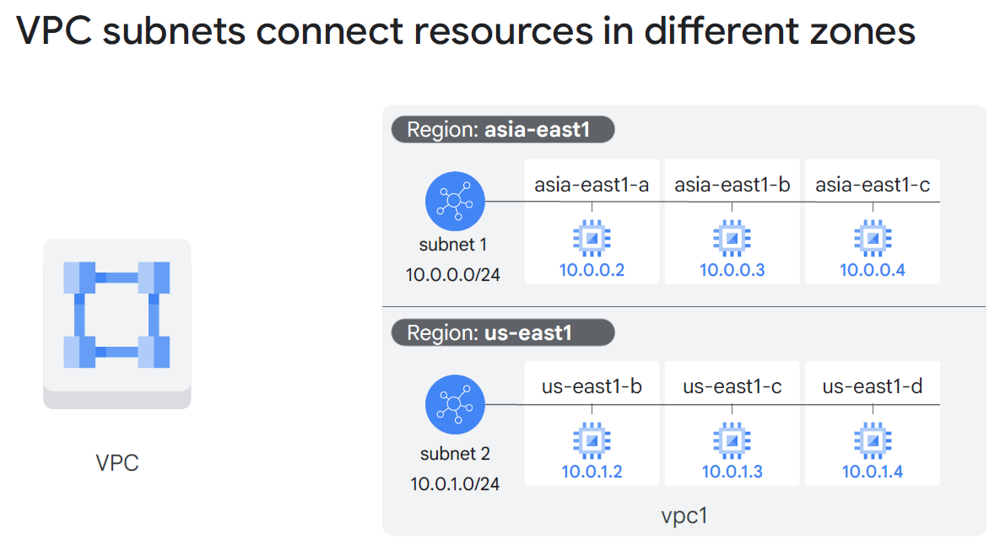
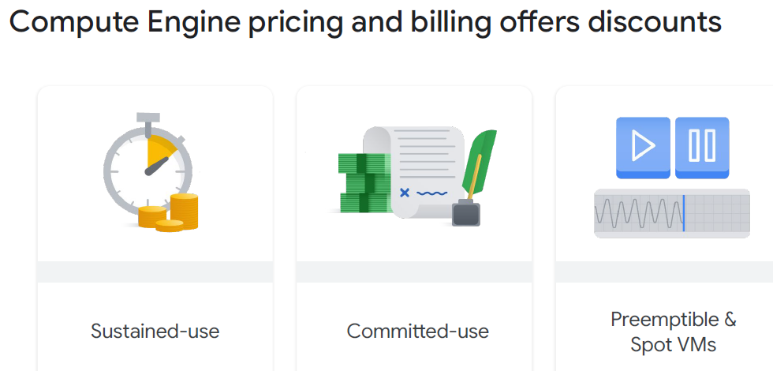
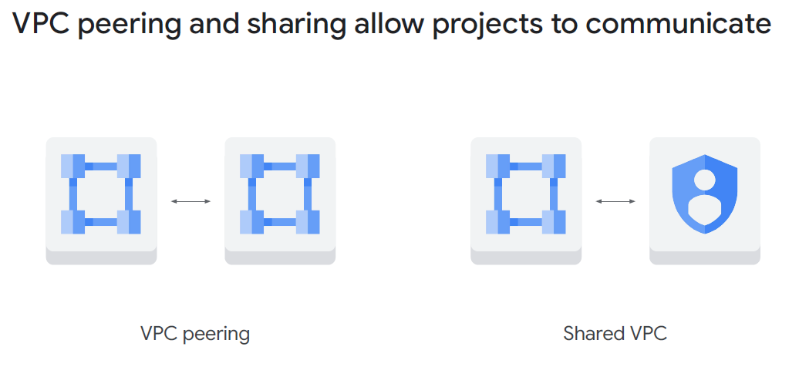
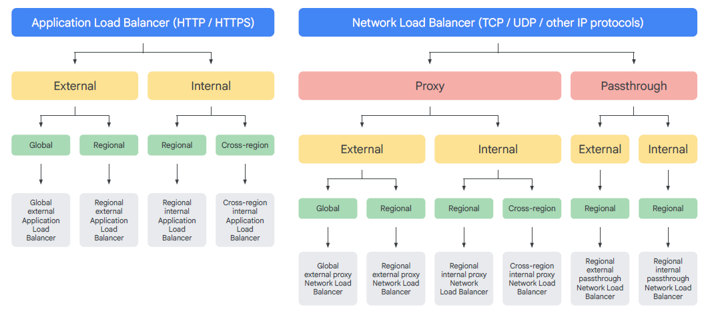
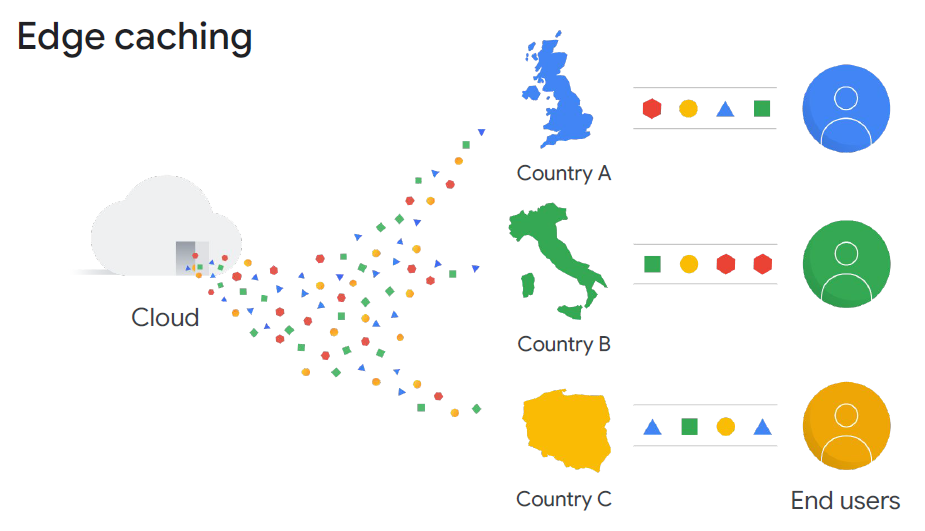
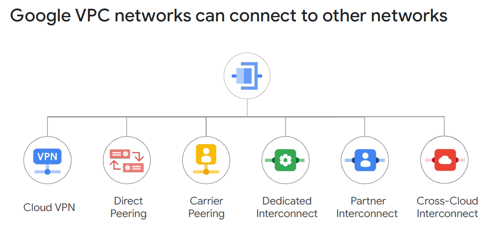
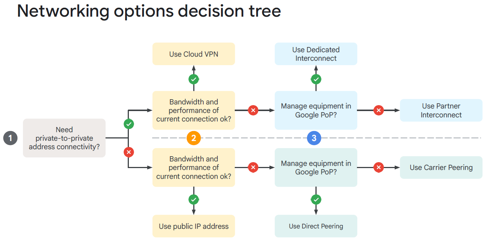

# Module 3: VPC & Compute Engine

## Status: ✅ Completed (Day 1 · 2026.04.08)

## 🔗 Quick Navigation

- Q&A Review: [qa-review.md](qa-review.md)

---

## 📝 Learning Objectives

By the end of this module, you will understand:

- [x] What a VPC is and why GCP VPCs are global resources
- [x] Auto mode vs. Custom mode VPCs and when to use each
- [x] How firewall rules work in GCP (VM-level, not network-boundary)
- [x] Compute Engine VM configuration options and custom machine types
- [x] Vertical vs. horizontal VM scaling strategies
- [x] VPC Peering and Shared VPC for cross-project networking
- [x] The four types of GCP load balancers and when to use each
- [x] Cloud DNS and Cloud CDN
- [x] Connectivity options for hybrid/on-premises networking (VPN, Interconnect, Peering)

---

## 📚 Key Concepts

### 1. Virtual Private Cloud (VPC)

A **Virtual Private Cloud (VPC)** is a private, isolated network environment within Google Cloud that hosts your VMs, containers, and other resources.

**Key Characteristic: GCP VPCs are Global**
> **Official slide wording:** "VPC networks are global. They can also have subnets in any Google Cloud region worldwide. **Subnets can span the zones that make up a region.** Resources can even be in different zones on the same subnet. This makes it easy to define network layouts with global scope and build solutions that are resilient to disruptions, yet retain a simple network layout."

> **Exam Key Point:** Subnet scope = **Regional** (not zonal). A single subnet in `us-east1` can have VMs in `us-east1-b`, `us-east1-c`, and `us-east1-d` simultaneously.

| Feature          | GCP VPC                                 | AWS VPC (for comparison)                                |
|------------------|-----------------------------------------|---------------------------------------------------------|
| **Scope**        | **Global** — one VPC spans all regions  | Regional — separate VPCs per region                     |
| **Routing**      | Automatic global routing across regions | Requires VPC Peering or Transit Gateway between regions |
| **Subnet scope** | Regional (subnets are regional)         | Availability Zone-specific                              |

This means: a single GCP VPC can have subnets in `us-central1`, `europe-west1`, and `asia-east1` — and VMs in all those regions can communicate using internal IPs within the same VPC.

---

### 2. Auto Mode vs. Custom Mode VPCs

| Feature             | Auto Mode                                   | Custom Mode                 |
|---------------------|---------------------------------------------|-----------------------------|
| **Subnet creation** | Automatically creates one subnet per region | You define subnets manually |
| **IP ranges**       | Fixed pre-defined CIDR blocks per region    | You choose any CIDR range   |
| **Flexibility**     | Limited — cannot customize IP ranges        | Full control                |
| **Scalability**     | Limited for large or complex deployments    | Recommended for production  |
| **Use case**        | Quick demos, testing, learning              | Production environments     |

> **Best Practice:** Use **Custom Mode** for production workloads. Auto Mode is convenient but uses fixed IP ranges that may conflict with other networks when peering.

**Default VPC:**
- Every new project has a default VPC in Auto Mode
- Contains pre-configured firewall rules (allow SSH, RDP, ICMP)
- Good for getting started; replace with Custom Mode for production

---

### 3. Firewall Rules

GCP firewall rules are applied at the **VM instance level** using tags or service accounts — not at the network boundary.

**Default Firewall Behavior:**
| Traffic Direction     | Default Policy                               |
| --------------------- | -------------------------------------------- |
| **Outbound (Egress)** | All allowed by default                       |
| **Inbound (Ingress)** | All denied by default (except rules you add) |

**Firewall Rule Components:**

| Component              | Description                                                                    | Example                    |
|------------------------|--------------------------------------------------------------------------------|----------------------------|
| **Direction**          | Ingress (inbound) or Egress (outbound)                                         | `INGRESS`                  |
| **Priority**           | 0 (highest) to 65535 (lowest); lower number wins                               | `1000`                     |
| **Action**             | Allow or Deny                                                                  | `ALLOW`                    |
| **Target**             | Which VMs this rule applies to (all instances, network tags, service accounts) | Tag: `web-server`          |
| **Source/Destination** | IP ranges or tags for ingress/egress                                           | `0.0.0.0/0` (all internet) |
| **Protocol/Port**      | TCP, UDP, ICMP; specific ports                                                 | `tcp:80,443`               |

**Targeting with Network Tags:**
- Assign a tag like `web-server` to VMs that should receive web traffic
- Create a firewall rule targeting tag `web-server` to allow TCP:80 and TCP:443
- Only VMs with that tag receive the rule

**Micro-segmentation:** Apply different firewall rules to different tiers (web, app, database) using tags — each tier gets only what it needs.

---

### 4. Compute Engine — Virtual Machines

**Compute Engine** is Google Cloud's IaaS compute service. You fully control the VM configuration:

| Configuration        | Options                                                              |
|----------------------|----------------------------------------------------------------------|
| **CPU Platform**     | Intel (Haswell, Skylake, Cascade Lake), AMD (EPYC)                   |
| **vCPU count**       | From 1 to 416 vCPUs per VM                                           |
| **Memory**           | From 0.5 GB up to 12 TB                                              |
| **Operating System** | Debian, Ubuntu, CentOS, RHEL, Windows Server, Container-Optimized OS |
| **Boot disk**        | Standard HDD, SSD, Balanced SSD                                      |
| **Additional disks** | Up to 128 persistent disks per instance                              |
| **Network**          | Multiple network interfaces possible                                 |
| **Service account**  | Assign a service account for API access                              |
| **Startup scripts**  | Automate software installation at VM launch                          |

**Machine Type Families:**

| Family                    | Purpose                                | Example Types                |
|---------------------------|----------------------------------------|------------------------------|
| **General Purpose**       | Balanced CPU/memory for most workloads | `e2-medium`, `n2-standard-4` |
| **Compute Optimized**     | High CPU performance                   | `c2-standard-4`              |
| **Memory Optimized**      | High memory for in-memory databases    | `m2-megamem-416`             |
| **Accelerator Optimized** | GPUs for ML/HPC                        | `a2-highgpu-1g`              |

**Custom Machine Types:**
- Define exact vCPU and memory (e.g., 6 vCPUs with 20 GB RAM)
- Avoids overprovisioning when predefined types don't match your needs
- Priced per vCPU and per GB of memory

> **Exam Tip:** Custom machine types allow right-sizing, which is a cost optimization strategy unique to GCP. You pay only for the exact resources you configure.

**Pricing Discounts:**

| Discount Type              | How It Works                                                                                   | Savings   |
|----------------------------|------------------------------------------------------------------------------------------------|-----------|
| **Sustained-use**          | Automatically applied when a VM runs >25% of a month; discount increases per additional minute | Up to 30% |
| **Committed-use**          | Purchase specific vCPU/memory for 1 or 3 years in exchange for a lower rate                    | Up to 57% |
| **Preemptible / Spot VMs** | GCP can terminate the VM if resources are needed elsewhere; same performance as regular VMs    | Up to 90% |

**Preemptible vs. Spot VMs:**

| Feature                      | Preemptible VM                             | Spot VM                         |
|------------------------------|--------------------------------------------|---------------------------------|
| **Max runtime**              | 24 hours                                   | No maximum runtime              |
| **Can be terminated by GCP** | Yes                                        | Yes                             |
| **Pricing**                  | Same pricing as Spot                       | Same pricing as Preemptible     |
| **Use case**                 | Fault-tolerant batch jobs, data processing | Same; preferred (more features) |

> **Official slide wording:** "The per-hour price of Preemptible and Spot VMs incorporates a substantial discount. Preemptible and Spot VMs have the same performance as regular VMs."

> **Main reason to use:** **Reduce cost.** Not for performance, not for custom machine types, not for OS licensing. The correct answer is always cost.

---

### 5. VM Scaling Strategies

| Strategy               | Description                                  | Requires                                     | Downtime                                     |
|------------------------|----------------------------------------------|----------------------------------------------|----------------------------------------------|
| **Vertical Scaling**   | Add more CPU/RAM to an existing VM (resize)  | VM shutdown                                  | Yes — VM must stop to resize                 |
| **Horizontal Scaling** | Add more VM instances behind a load balancer | Instance templates + managed instance groups | No — new instances added/removed dynamically |

**Horizontal Scaling Components:**

| Component                        | Purpose                                                                          |
|----------------------------------|----------------------------------------------------------------------------------|
| **Instance Template**            | Blueprint for creating identical VM instances (machine type, OS, startup script) |
| **Managed Instance Group (MIG)** | A group of VMs created from an instance template; supports autoscaling           |
| **Autoscaler**                   | Automatically adds/removes VMs based on CPU, request rate, or custom metrics     |
| **Load Balancer**                | Distributes incoming traffic across all healthy VMs in the group                 |

**Autoscaling Policy Signals:**
- CPU utilization (e.g., scale out when > 70%)
- Load balancing serving capacity (requests per second)
- Cloud Monitoring custom metrics
- Cloud Pub/Sub queue depth

---

### 6. VPC Connectivity — Peering and Shared VPC

**VPC Peering:**
- Connect **two separate VPC networks** (same or different projects/organizations) so they can communicate using internal IPs
- Traffic stays within Google's network (no internet exposure)
- **Requirement:** IP address ranges must NOT overlap
- **Non-transitive:** If VPC-A peers with VPC-B and VPC-B peers with VPC-C, VPC-A cannot talk to VPC-C through VPC-B

**Shared VPC:**
- A **host project** shares its VPC with **service projects**
- Centralized network management — one team controls the VPC; other teams deploy resources into it
- Resources in service projects use the host project's subnets and firewall rules
- Ideal for large organizations wanting centralized network governance

| Feature               | VPC Peering                                | Shared VPC                                       |
|-----------------------|--------------------------------------------|--------------------------------------------------|
| **Network ownership** | Each org/project owns its VPC              | Host project owns the VPC                        |
| **Admin model**       | Decentralized                              | Centralized (host project admin manages network) |
| **Use case**          | Connect two independently managed networks | Large orgs with central network team             |

---

### 7. Load Balancing

GCP offers multiple load balancer types to match different traffic patterns:

| Load Balancer                 | Scope    | Traffic             | Layer           | Use Case                                          |
|-------------------------------|----------|---------------------|-----------------|---------------------------------------------------|
| **Global External HTTP(S)**   | Global   | External (internet) | L7 (HTTP/HTTPS) | Web apps; cross-region failover; URL routing      |
| **Regional External HTTP(S)** | Regional | External            | L7              | Regional web apps                                 |
| **External TCP/SSL Proxy**    | Global   | External            | L4 (TCP)        | Non-HTTP TCP apps (e.g., databases over internet) |
| **External Network TCP/UDP**  | Regional | External            | L4              | UDP or raw TCP; not proxied                       |
| **Internal HTTP(S)**          | Regional | Internal (VPC)      | L7              | Internal microservices, APIs                      |
| **Internal TCP/UDP**          | Regional | Internal            | L4              | Internal database or app tier                     |

**Key Distinction:**
- **Global Load Balancers** run on Google's **edge PoPs** — traffic enters Google's network at the nearest PoP, enabling cross-region failover and anycast routing
- **Regional Load Balancers** operate within a single region

**Layer 7 Capabilities (HTTP/HTTPS LB):**
- Route traffic based on URL path (`/api/*` → backend A, `/static/*` → backend B)
- SSL/TLS termination
- Cloud Armor integration for WAF and DDoS protection
- Health checks and automatic failover

---

### 8. Cloud DNS & Cloud CDN

**Cloud DNS:**

| Feature      | Detail                                                                     |
|--------------|----------------------------------------------------------------------------|
| **Type**     | Managed, authoritative DNS service                                         |
| **SLA**      | 100% uptime SLA                                                            |
| **Latency**  | Low-latency responses via Google's global anycast DNS servers              |
| **Supports** | Public zones (internet-facing) and private zones (internal VPC resolution) |
| **Use case** | Host your domain's DNS records; eliminate need to run DNS servers          |

**Cloud CDN (Content Delivery Network):**

| Feature                | Detail                                                                |
|------------------------|-----------------------------------------------------------------------|
| **What it does**       | Caches static content (images, JS, CSS, videos) at Google's edge PoPs |
| **Benefit**            | Reduces latency for end users + reduces load on origin servers        |
| **Integration**        | Works with Global External HTTP(S) Load Balancer                      |
| **Cache invalidation** | Manual purge via Console, gcloud, or API                              |
| **Use case**           | Static website assets, media streaming, software distribution         |

---

### 9. Hybrid Connectivity Options

Options for connecting your on-premises network or another cloud to Google Cloud:

| Option                       | Type                                                    | Speed                   | SLA            | Use Case                                                                      |
|------------------------------|---------------------------------------------------------|-------------------------|----------------|-------------------------------------------------------------------------------|
| **Cloud VPN**                | Encrypted tunnel over public internet                   | Up to 3 Gbps per tunnel | 99.9%          | Low-cost remote office connectivity; dev/test hybrid setups                   |
| **Dedicated Interconnect**   | Direct physical fiber to Google                         | 10 Gbps or 100 Gbps     | 99.9% – 99.99% | High-bandwidth, low-latency enterprise workloads                              |
| **Partner Interconnect**     | Via a third-party network provider                      | 50 Mbps – 50 Gbps       | 99.9% – 99.99% | Sites without Dedicated Interconnect access                                   |
| **Direct Peering**           | Direct BGP session at Google PoP                        | Varies                  | No SLA         | Access to Google services (Workspace, YouTube); not for GCP workloads         |
| **Carrier Peering**          | Via ISP at Google PoP                                   | Varies                  | No SLA         | Access to Google services via ISP                                             |
| **Cross-Cloud Interconnect** | Dedicated physical connection to another cloud provider | 10 Gbps or 100 Gbps     | —              | Multicloud strategy; connect GCP VPC to AWS, Azure, or other supported clouds |

**Networking Options Decision Tree** (3 questions from official ILT slides):

1. **Do you need private-to-private address connectivity?**
   - No → use public IP addresses
   - Yes → continue to Q2
2. **Does the bandwidth and performance of your current internet connection meet your requirements?**
   - Yes → use **Cloud VPN**
   - No → continue to Q3
3. **Are you willing to manage routing equipment in a Google PoP?**
   - Yes → use **Dedicated Interconnect** or **Direct Peering**
   - No → use **Partner Interconnect** or **Carrier Peering**

**Choosing the Right Option:**
- **Cost-sensitive, less critical:** Cloud VPN
- **High bandwidth, low latency, SLA required:** Dedicated Interconnect
- **Cannot get Dedicated Interconnect to your location:** Partner Interconnect

> **Exam Tip:** Cloud VPN traffic travels over the **public internet** (encrypted). Dedicated and Partner Interconnect traffic travels via **private leased lines** and never crosses the public internet.

---

## 🔗 References & Links

| **Resource**                                                                                    | **Description**                                                        |
|-------------------------------------------------------------------------------------------------|------------------------------------------------------------------------|
| [VPC Overview](https://cloud.google.com/vpc/docs/overview)                                      | Official VPC documentation: subnets, routing, firewall rules           |
| [Compute Engine Overview](https://cloud.google.com/compute/docs/overview)                       | VMs, machine types, custom machine types, pricing                      |
| [Firewall Rules](https://cloud.google.com/firewall/docs/firewalls)                              | How GCP firewall rules work and how to configure them                  |
| [Load Balancing Overview](https://cloud.google.com/load-balancing/docs/load-balancing-overview) | All load balancer types: global vs regional, L4 vs L7                  |
| [Cloud DNS](https://cloud.google.com/dns/docs/overview)                                         | Managed DNS with 100% SLA                                              |
| [Cloud CDN](https://cloud.google.com/cdn/docs/overview)                                         | Edge caching with Google's global PoP network                          |
| [Hybrid Connectivity](https://cloud.google.com/network-connectivity/docs/how-to/choose-product) | Choosing between VPN, Partner Interconnect, and Dedicated Interconnect |

---

## ❓ Key Questions to Review

- What makes GCP's VPC global and why does that matter?
- What is the difference between auto mode and custom mode VPC?
- How do GCP firewall rules differ from traditional network-level firewalls?
- What is the default ingress/egress policy for a GCP VPC?
- What are custom machine types and when would you use them?
- What is the difference between vertical and horizontal scaling?
- What are the components required for horizontal autoscaling in GCP?
- What is the difference between VPC Peering and Shared VPC?
- When would you use a global load balancer vs. a regional one?
- What is the difference between L4 and L7 load balancing?
- What are the three options for connecting on-premises networks to GCP?
- What is the SLA and bandwidth range for Dedicated Interconnect?

---

## 📌 Summary

| Concept            | Key Point                                                                                  |
|--------------------|--------------------------------------------------------------------------------------------|
| GCP VPC            | Global resource — one VPC spans all regions                                                |
| Mode               | Auto = pre-configured (demo); Custom = production                                          |
| Firewall Rules     | Applied at VM level (tags/service accounts), not network boundary                          |
| Default Policy     | All egress allowed; all ingress denied by default                                          |
| Compute Engine     | Fully customizable VMs; custom machine types for right-sizing                              |
| Vertical Scaling   | Resize VM — requires downtime                                                              |
| Horizontal Scaling | Instance template + MIG + autoscaler + load balancer                                       |
| VPC Peering        | Non-overlapping IPs, non-transitive                                                        |
| Shared VPC         | Centralized network for multi-project orgs                                                 |
| Load Balancers     | Global (edge, L7) vs Regional; External vs Internal; L4 vs L7                              |
| Cloud DNS          | 100% uptime SLA; public and private zones                                                  |
| Cloud CDN          | Cache at edge PoPs; reduces latency and origin load                                        |
| Connectivity       | VPN (internet, cheap) → Partner Interconnect → Dedicated Interconnect (private fiber, SLA) |
