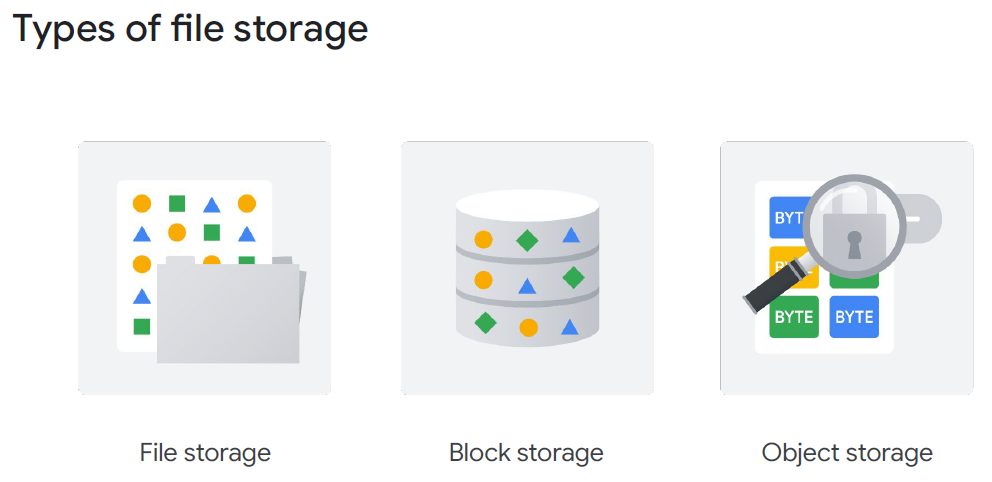
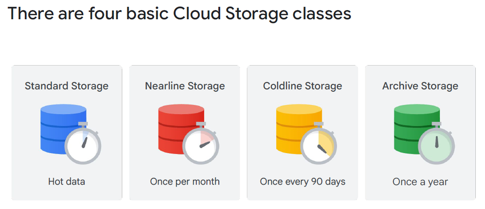
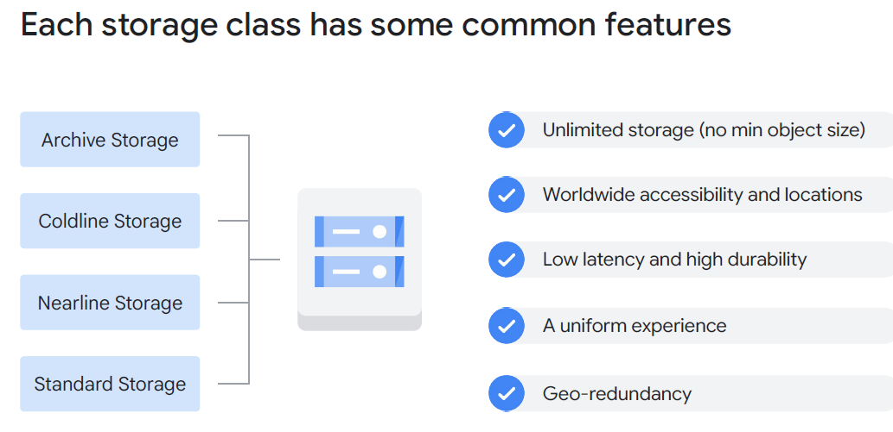
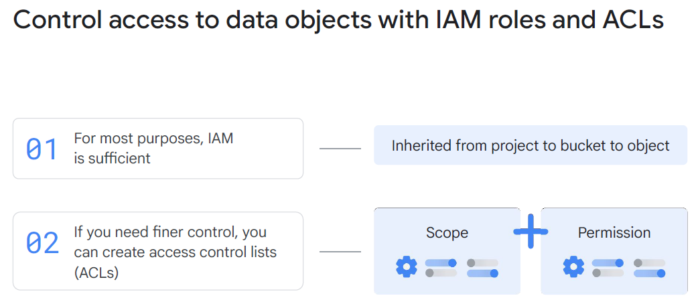
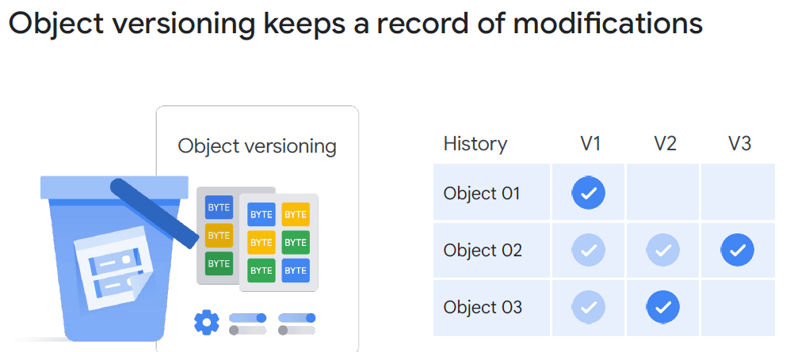
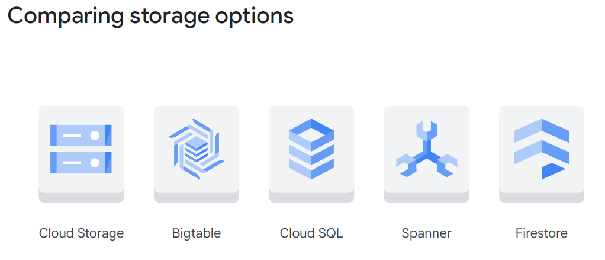

# Module 4: Cloud Storage & Databases

## Status: ✅ Completed (Day 2 · 2026.04.09)

## 🔗 Quick Navigation

- Q&A Review: [qa-review.md](qa-review.md)

---

## 📝 Learning Objectives

By the end of this module, you will understand:

- [x] What Cloud Storage is and how it differs from file and block storage
- [x] The structure of buckets and objects in Cloud Storage
- [x] The four storage location types and their availability trade-offs
- [x] The four storage classes and their cost/access pattern trade-offs
- [x] Access control options: uniform vs. fine-grained
- [x] Additional features: versioning, retention policies, lifecycle management, encryption
- [x] Data ingestion methods for different data volumes
- [x] When to use each managed database: Cloud SQL, Cloud Spanner, Firestore, Bigtable, BigQuery

---

## 📚 Key Concepts

### 1. Cloud Storage Overview

**Cloud Storage** is Google Cloud's managed **object storage** service — equivalent to AWS S3 and Azure Blob Storage.

**What it is:**
- Stores data as **immutable objects** (files treated as complete units; no in-place editing)
- Objects stored inside **buckets**
- Accessible via HTTP(S) — every object has a globally addressable URL
- Fully managed — no servers, disks, or capacity planning required

**What it is NOT:**

| Storage Type       | Description                                             | GCP Service                        |
|--------------------|---------------------------------------------------------|------------------------------------|
| **Object Storage** | Immutable blobs accessed via URL/API                    | **Cloud Storage**                  |
| **File Storage**   | Hierarchical files/folders with POSIX access (NFS, SMB) | **Filestore** (managed NFS)        |
| **Block Storage**  | Raw volumes mounted as disks on VMs                     | **Persistent Disk**, **Hyperdisk** |

> **Exam Tip:** Cloud Storage is NOT a file system. You cannot mount it as a drive or use it for databases requiring random-access disk I/O. If an application requires NFS, use **Filestore**. For VM disks, use **Persistent Disk**.

> **Note:** Although Cloud Storage is not a file system, third-party tools can "mount" a bucket and allow it to be used as if it were a typical Linux or macOS directory. This does not make it a true POSIX file system.



---

### 2. Buckets and Objects

**Buckets:**

| Property           | Detail                                                            |
| ------------------ | ----------------------------------------------------------------- |
| **Naming**         | Globally unique across all of GCP; used in object URLs            |
| **Nesting**        | Buckets cannot be nested inside other buckets                     |
| **Location**       | Set at creation time; cannot be changed after                     |
| **Storage class**  | Default set at bucket level; individual objects can override      |
| **Access control** | Configured at bucket level (uniform) or per-object (fine-grained) |

**Objects:**

| Property              | Detail                                                             |
| --------------------- | ------------------------------------------------------------------ |
| **Max size**          | 5 TB per single object                                             |
| **Total storage**     | Virtually unlimited                                                |
| **Immutability**      | Objects cannot be modified in-place; you replace the entire object |
| **URL format**        | `https://storage.googleapis.com/BUCKET_NAME/OBJECT_NAME`           |
| **Folder simulation** | Object names with `/` simulate folders (e.g., `images/photo.jpg`)  |

---

### 3. Storage Location Types

Choose location type at **bucket creation** — determines where data is physically stored and its availability characteristics:

| Location Type      | Data Stored In                                            | Availability | Latency    | Use Case                                        |
|--------------------|-----------------------------------------------------------|--------------|------------|-------------------------------------------------|
| **Single-Zone**    | One zone (one data center)                                | Lowest       | Lowest     | Short-lived, high-performance, replaceable data |
| **Regional**       | Multiple zones in one region                              | Medium       | Low        | VM workloads, analytics, data within a region   |
| **Dual-Region**    | Two specific regions (plus Google-managed geo redundancy) | High         | Low–Medium | Business continuity; optional turbo replication |
| **Multi-Regional** | 3+ regions across a continent (US, EU, or Asia)           | Highest      | Medium     | Globally distributed static content, web assets |

**Key Trade-off:** Higher redundancy = higher cost and slightly higher latency.

> **Exam Tip:** For compliance scenarios where data must stay in one country, use **Regional** (single region) or **Single-Zone**. Multi-Regional spans a continent and may replicate to multiple countries within it.

---

### 4. Storage Classes

Storage classes control **cost vs. access frequency** trade-offs. Set a default on the bucket; override per object if needed.

| Storage Class | Min Storage Duration | Access Pattern      | Storage Cost          | Retrieval Fee  | Use Case                                     |
|---------------|----------------------|---------------------|-----------------------|----------------|----------------------------------------------|
| **Standard**  | None                 | Frequent (hot data) | Highest ($0.02/GB/mo) | None           | Active data, web assets, real-time analytics |
| **Nearline**  | 30 days              | < Once per month    | ~$0.01/GB/mo          | Yes ($0.01/GB) | Monthly backups, tap archives                |
| **Coldline**  | 90 days              | < Once per quarter  | Lower than Nearline   | Yes (higher)   | Quarterly archival, compliance data          |
| **Archive**   | 365 days             | < Once per year     | Lowest                | Highest        | Long-term compliance, regulatory logs        |



**Autoclass:**
- Google automatically moves objects between classes based on **access patterns**
- Objects accessed frequently stay in Standard; rarely accessed objects move to Nearline → Coldline → Archive
- Simplifies class management; good when access patterns are unpredictable

> **Official slide wording:** "Autoclass automatically transitions objects to appropriate storage classes based on each object's access pattern. The feature moves data that is not accessed to colder storage classes to reduce storage cost, and moves data that is accessed to Standard storage to optimize future accesses."

**Common Features Across ALL Storage Classes:**

> All four storage classes share these characteristics (from official ILT slides):

| Feature                             | Detail                                                                                                        |
|-------------------------------------|---------------------------------------------------------------------------------------------------------------|
| **Unlimited storage**               | No minimum object size requirement                                                                            |
| **Worldwide accessibility**         | Accessible from any location                                                                                  |
| **Low latency and high durability** | Consistent performance and 11 nines (99.999999999%) durability                                                |
| **Uniform experience**              | Same security tools, APIs, and client libraries across all classes                                            |
| **Geo-redundancy**                  | Applies when stored in a multi-region or dual-region; physical servers in geographically diverse data centers |



> **Exam Tip:** Retrieval fees apply to Nearline, Coldline, and Archive. If data is frequently accessed, Nearline can become more expensive than Standard despite the lower storage rate. Always factor in retrieval costs.

---

### 5. Access Control

| Method                                | Description                                                          | When to Use                                                      |
|---------------------------------------|----------------------------------------------------------------------|------------------------------------------------------------------|
| **Uniform Bucket-Level Access**       | IAM policies apply uniformly to all objects in the bucket            | Recommended; simpler to manage                                   |
| **Fine-Grained Access (object ACLs)** | Per-object Access Control Lists; supports legacy XML API permissions | Legacy integrations; when specific objects need different access |

**Recommended Approach:**
- Use **Uniform** for new buckets — manages access through IAM at the bucket level
- Use **separate buckets** for different access requirements (e.g., one public, one private)
- Avoid mixing public and private objects in the same bucket



**IAM Roles for Cloud Storage:**

| Role                          | Permissions                       |
|-------------------------------|-----------------------------------|
| `roles/storage.objectViewer`  | Read objects in buckets           |
| `roles/storage.objectCreator` | Create (upload) objects           |
| `roles/storage.objectAdmin`   | Full object management            |
| `roles/storage.admin`         | Full bucket and object management |

**Making Objects Public:**
- Grant `allUsers` the `roles/storage.objectViewer` role at the bucket level (for static website hosting)

---

### 6. Additional Features

**Object Versioning:**
- Keeps prior versions of an object when it is replaced or deleted
- Versions are accessible with a generation number
- Useful for: accidental deletion recovery, audit trails
- **Lifecycle policies** can auto-delete old versions after N days



**Retention Policies:**
- Enforce a **minimum retention period** on all objects in a bucket
- Objects cannot be deleted or overwritten until the retention period expires
- Used for regulatory compliance (e.g., "financial records must be kept 7 years")
- Can be **locked** — once locked, cannot be shortened or removed

**Lifecycle Management:**
- Automate actions on objects based on age, access, or version count:
  - Delete objects older than 30 days
  - Move objects to Nearline after 30 days, Coldline after 90 days
  - Delete non-current versions after 7 days

**Encryption:**

| Encryption Type                              | Who Manages Keys                   | Use Case                                     |
| -------------------------------------------- | ---------------------------------- | -------------------------------------------- |
| **Google-managed encryption keys**           | Google (automatic default)         | Standard; no configuration needed            |
| **Customer-managed encryption keys (CMEK)**  | Customer via Cloud KMS             | Compliance requiring key lifecycle control   |
| **Customer-supplied encryption keys (CSEK)** | Customer provides keys per request | Maximum control; Google never stores the key |

---

### 7. Data Ingestion Methods

| Method                             | Transport                         | Best For                                                                 |
|------------------------------------|-----------------------------------|--------------------------------------------------------------------------|
| **Cloud Console / gcloud / API**   | Internet (online)                 | Small to medium data; occasional uploads                                 |
| **Storage Transfer Service**       | Online (managed service)          | Large-scale transfers from other clouds (S3, Azure Blob) or HTTP sources |
| **Transfer Appliance**             | Physical device shipped by Google | Petabyte-scale or when internet bandwidth is insufficient                |
| **BigQuery Data Transfer Service** | Online                            | Transfer from SaaS apps (Google Ads, YouTube, etc.) to BigQuery          |

---

### 8. Google Cloud Managed Databases

Google Cloud offers a portfolio of managed databases for different workloads:

| Service           | Type                                       | Scale              | Serverless | Key Properties                                                      | Use Case                                             |
|-------------------|--------------------------------------------|--------------------|------------|---------------------------------------------------------------------|------------------------------------------------------|
| **Cloud SQL**     | Relational (MySQL, PostgreSQL, SQL Server) | Max 64 TB/instance | No         | Regional; failover replicas; managed patching                       | Traditional apps, web backends, ERP                  |
| **Cloud Spanner** | Relational (proprietary)                   | Petabyte-scale     | No         | Global/multi-region; strong consistency; 99.999% SLA                | Global financial systems, inventory, high-scale OLTP |
| **Firestore**     | NoSQL (document)                           | Automatic          | Yes        | Serverless; multi-region; offline sync; real-time updates           | Mobile/web apps, real-time collaboration             |
| **Bigtable**      | NoSQL (wide-column)                        | Petabyte-scale     | No         | High-throughput; low latency; node-based scaling                    | IoT, time-series, analytics ingestion                |
| **BigQuery**      | Data Warehouse (analytical SQL)            | Petabyte-scale     | Yes        | Serverless; queries data in-place; columnar storage; ML integration | Analytics, BI dashboards, data lakes                 |

**Decision Guide:**

```
Need relational (SQL)?
    Yes → Need global, petabyte scale?
              Yes → Cloud Spanner
              No  → Cloud SQL (up to 64 TB, regional)
    No → Need documents / real-time sync for mobile?
              Yes → Firestore
              No  → Need high-throughput wide-column for IoT/time-series?
                        Yes → Bigtable
                        No  → Analytical queries on large datasets?
                                  Yes → BigQuery
```

**Key Differentiators:**

| Service       | NOT for...                                                                                        |
|---------------|---------------------------------------------------------------------------------------------------|
| Cloud SQL     | Global scale (64 TB limit); not for petabyte workloads                                            |
| Cloud Spanner | Simple low-traffic apps — costs more than Cloud SQL                                               |
| Firestore     | High-throughput analytics; not for relational schemas                                             |
| Bigtable      | Ad-hoc SQL queries; not for small datasets (node cost)                                            |
| BigQuery      | Transactional operations (INSERT/UPDATE/DELETE at high rate); high latency for single-row lookups |

> **Exam Tip:** BigQuery is an **analytical warehouse**, NOT a transactional database. It excels at scanning billions of rows for aggregations, not at low-latency single-record reads/writes.



---

## 🔗 References & Links

| **Resource**                                                                      | **Description**                                                       |
|-----------------------------------------------------------------------------------|-----------------------------------------------------------------------|
| [Cloud Storage Overview](https://cloud.google.com/storage/docs/introduction)      | Object storage concepts, storage classes, and access control          |
| [Storage Class Comparison](https://cloud.google.com/storage/docs/storage-classes) | Detailed comparison of Standard, Nearline, Coldline, Archive          |
| [Object Lifecycle Management](https://cloud.google.com/storage/docs/lifecycle)    | Automate transitions and deletions with lifecycle rules               |
| [Cloud SQL Overview](https://cloud.google.com/sql/docs/introduction)              | Managed relational database service for MySQL, PostgreSQL, SQL Server |
| [Cloud Spanner Overview](https://cloud.google.com/spanner/docs/overview)          | Globally distributed relational database                              |
| [Firestore Overview](https://cloud.google.com/firestore/docs/overview)            | Serverless, scalable document database                                |
| [Bigtable Overview](https://cloud.google.com/bigtable/docs/overview)              | High-throughput NoSQL for time-series and IoT                         |
| [BigQuery Overview](https://cloud.google.com/bigquery/docs/introduction)          | Serverless analytics data warehouse                                   |
| [Choosing a Database](https://cloud.google.com/products/databases)                | GCP guide to selecting the right database product                     |

---

## ❓ Key Questions to Review

- What type of storage is Cloud Storage — file, block, or object?
- What is the maximum object size in Cloud Storage?
- What are the four storage classes and their minimum storage durations?
- What does Autoclass do and when should you enable it?
- What is the difference between Uniform and Fine-grained access control?
- How does Object Versioning work and what is its cost implication?
- What is a Retention Policy and what makes it different from a lifecycle rule?
- When would you use Cloud SQL vs. Cloud Spanner?
- What is the key technical capability that makes Cloud Spanner unique?
- What is Firestore best suited for?
- What distinguishes Bigtable from other GCP databases?
- Why is BigQuery not suitable for transactional workloads?

---

## 📌 Summary

| Concept            | Key Point                                                                      |
|--------------------|--------------------------------------------------------------------------------|
| Cloud Storage      | Object storage — immutable objects in globally-named buckets; max 5 TB/object  |
| Not a filesystem   | For NFS → Filestore; for VM disks → Persistent Disk                            |
| Location types     | Single-zone → Regional → Dual-region → Multi-regional (cost ↑, availability ↑) |
| Storage classes    | Standard (hot) → Nearline (<1/mo) → Coldline (<1/qtr) → Archive (<1/yr)        |
| Autoclass          | Auto-moves objects between classes based on access patterns                    |
| Access control     | Uniform (IAM, recommended) vs. Fine-grained (ACLs, legacy)                     |
| Versioning         | Recover previous versions; pair with lifecycle to control cost                 |
| Retention Policies | Minimum keep time for compliance; lockable                                     |
| Lifecycle          | Automate class transitions and deletions                                       |
| Cloud SQL          | Relational, regional, up to 64 TB                                              |
| Cloud Spanner      | Global relational, petabyte, strong consistency                                |
| Firestore          | Serverless document DB, offline sync, mobile/web                               |
| Bigtable           | High-throughput NoSQL, IoT/time-series                                         |
| BigQuery           | Serverless analytics warehouse; not transactional                              |
