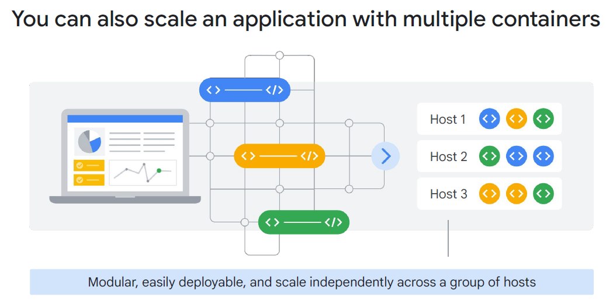
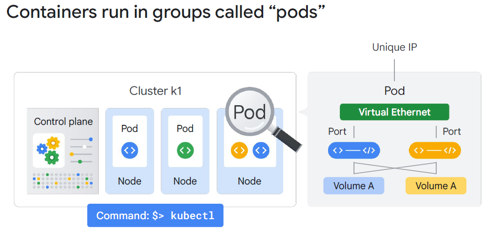
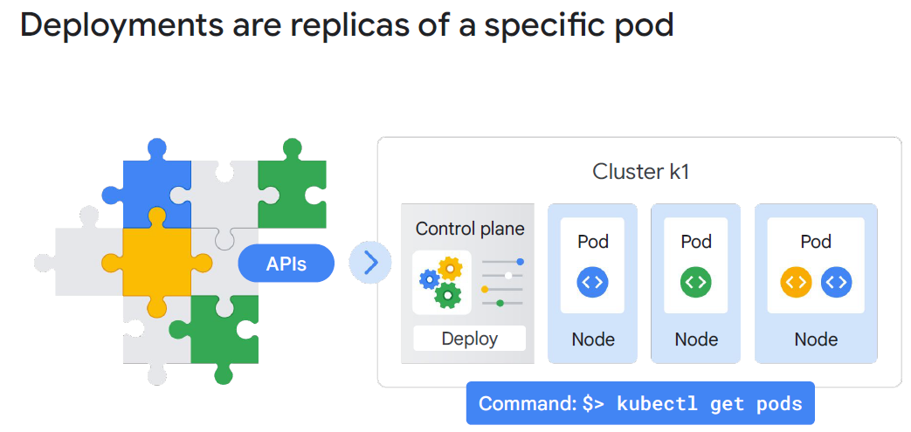
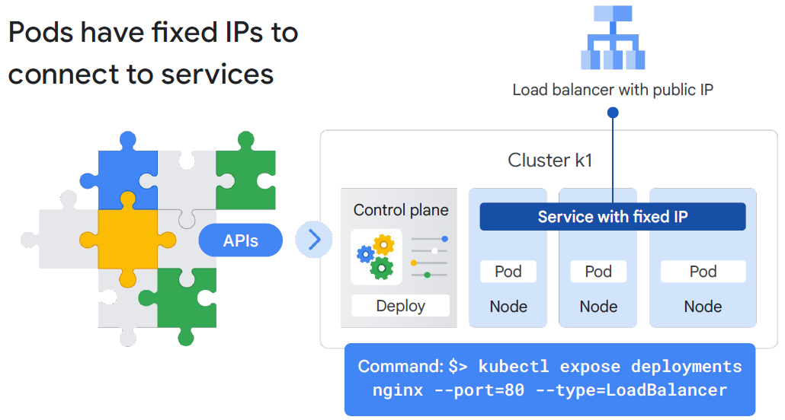
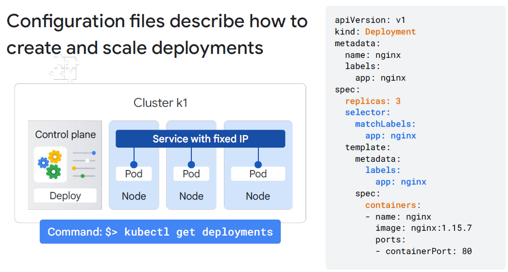
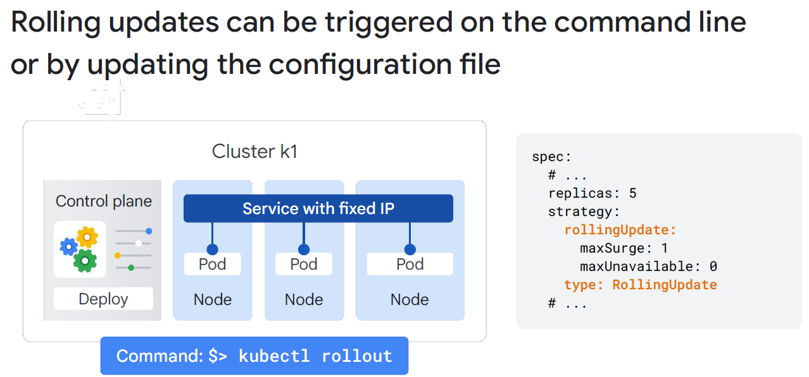

# Module 5: Containers & Kubernetes

## Status: ✅ Completed (Day 2 · 2026.04.09)

## 🔗 Quick Navigation

- Q&A Review: [qa-review.md](qa-review.md)

---

## 📝 Learning Objectives

By the end of this module, you will understand:

- [x] Why containers were invented and how they compare to VMs
- [x] Kubernetes architecture: control plane, nodes, and core objects
- [x] The difference between Pods, Deployments, and Services
- [x] Imperative vs. declarative management in Kubernetes
- [x] The `kubectl` CLI tool and common commands
- [x] Google Kubernetes Engine (GKE) Standard vs. Autopilot modes

---

## 📚 Key Concepts

### 1. Why Containers?

**Problem with Traditional Servers:**
- Applications deployed on dedicated servers → severe resource underutilization (CPU often idle)
- "It works on my machine" — different environments cause deployment failures

**Problem with VMs:**
- Better resource utilization but each VM includes a full OS (GBs of overhead)
- VMs take **minutes** to start
- VMs are slow to provision and heavyweight to manage at scale (hundreds of VMs = hundreds of OS instances to patch)

**Containers solve these problems:**

| Feature                  | Virtual Machine              | Container                           |
|--------------------------|------------------------------|-------------------------------------|
| **OS**                   | Full OS per VM (GB overhead) | Shares host OS kernel (MB overhead) |
| **Startup time**         | Minutes                      | Seconds (or milliseconds)           |
| **Resource isolation**   | Hardware-level (hypervisor)  | OS-level (namespaces, cgroups)      |
| **Portability**          | VM images are cloud-specific | Docker images run anywhere          |
| **Density**              | 10s of VMs per host          | 100s of containers per host         |
| **Dependency packaging** | Included in OS image         | Included in container image         |

**Container Benefits:**
1. **Consistency:** The container image includes the app AND its dependencies — guaranteed to run identically everywhere
2. **Speed:** Seconds to start a new container instance vs. minutes to boot a VM
3. **Efficiency:** Run far more workloads on the same hardware
4. **Portability:** Run the same container on GKE, local Docker, EKS, AKS

---

### 2. Container Challenges at Scale

Running a few containers is easy. Running thousands introduces operational complexity:

- How do you schedule containers across multiple machines?
- How do you restart a container if it crashes?
- How do you roll out updates without downtime?
- How do you scale out when traffic increases?
- How do you route traffic to the right container instances?
- How do you manage secrets and configuration?

**Answer: Container Orchestration → Kubernetes**



---

### 3. Kubernetes Overview

**Kubernetes** (K8s) is an open-source container orchestration system that automates deployment, scaling, and management of containerized applications.

| Fact             | Detail                                                                                  |
|------------------|-----------------------------------------------------------------------------------------|
| **Origin**       | Inspired by Google's internal system `Borg`                                             |
| **Open-sourced** | Released by Google in 2014; donated to the Cloud Native Computing Foundation (CNCF)     |
| **Current**      | Industry standard for container orchestration; runs on all major clouds and on-premises |

---

### 4. Kubernetes Architecture

```
┌─────────────────────────────── Cluster ──────────────────────────────────┐
│                                                                          │
│   ┌──────────────── Control Plane ─────────────────┐                     │
│   │  API Server  |  Scheduler  |  Controller Mgr   │                     │
│   │  etcd (cluster state storage)                  │                     │
│   └────────────────────────────────────────────────┘                     │
│                                                                          │
│   ┌── Node ──────┐  ┌── Node ──────┐  ┌── Node ──────┐                   │
│   │  kubelet     │  │  kubelet     │  │  kubelet     │                   │
│   │  [Pod][Pod]  │  │  [Pod][Pod]  │  │  [Pod]       │                   │
│   └──────────────┘  └──────────────┘  └──────────────┘                   │
└──────────────────────────────────────────────────────────────────────────┘
```

**Control Plane Components:**

| Component              | Role                                                                                          |
|------------------------|-----------------------------------------------------------------------------------------------|
| **API Server**         | Entry point for all cluster operations; kubectl communicates here                             |
| **Scheduler**          | Decides which node a new Pod should run on based on resource availability                     |
| **Controller Manager** | Runs controllers that reconcile actual state with desired state (e.g., ReplicaSet controller) |
| **etcd**               | Key-value store that holds all cluster state (source of truth)                                |

**Nodes (Worker Nodes):**

| Component             | Role                                                                             |
|-----------------------|----------------------------------------------------------------------------------|
| **kubelet**           | Agent on each node; receives instructions from control plane; manages containers |
| **kube-proxy**        | Maintains network rules for pod-to-pod and service-to-pod communication          |
| **Container Runtime** | Runs containers (Docker, containerd)                                             |

> **GKE Note:** In GKE, the **control plane is managed by Google** — you don't see or pay per control plane VM. You only see and pay for the worker nodes.



---

### 5. Core Kubernetes Objects

**Pod:**
- The **smallest deployable unit** in Kubernetes
- Contains one or more containers that share the same network namespace and storage volumes
- Containers in the same Pod communicate via `localhost`
- Pods are **ephemeral** — if a Pod crashes, Kubernetes creates a new one (possibly on a different node with a new IP)

```yaml
# Example Pod spec
apiVersion: v1
kind: Pod
metadata:
  name: web-pod
spec:
  containers:
  - name: web
    image: nginx:1.25
    ports:
    - containerPort: 80
```

**Deployment:**
- A controller that manages a **desired number of identical Pod replicas**
- Handles rolling updates and rollbacks
- Creates and manages a **ReplicaSet** under the hood

```yaml
# Example Deployment spec
apiVersion: apps/v1
kind: Deployment
metadata:
  name: web-app
spec:
  replicas: 3
  selector:
    matchLabels:
      app: web
  template:
    metadata:
      labels:
        app: web
    spec:
      containers:
      - name: web
        image: nginx:1.25
```

**Service:**
- Provides a **stable network endpoint** (virtual IP + port) for a set of Pods
- Pods have dynamic IPs; the Service IP is stable
- Acts as an internal load balancer across Pod replicas

| Service Type   | Exposure                                                                   |
|----------------|----------------------------------------------------------------------------|
| `ClusterIP`    | Internal only; accessible within the cluster                               |
| `NodePort`     | Exposes on a static port on each node's IP                                 |
| `LoadBalancer` | Creates a GCP External Load Balancer (for internet-facing services on GKE) |





---

### 6. Imperative vs. Declarative Management

| Approach        | Description                                                        | Example                            | Best For                               |
|-----------------|--------------------------------------------------------------------|------------------------------------|----------------------------------------|
| **Imperative**  | Direct commands telling Kubernetes what to do now                  | `kubectl run nginx --image=nginx`  | Ad-hoc tasks, debugging, quick tests   |
| **Declarative** | Describe the **desired state** in YAML/JSON; Kubernetes reconciles | `kubectl apply -f deployment.yaml` | Production workloads; GitOps workflows |

**Declarative Advantage:** If a Pod crashes or a node fails, Kubernetes continuously monitors and reconciles the actual state back to the declared desired state — without manual intervention.

> **Best Practice:** Use declarative YAML files in production. Store them in Git for version control and audit history (GitOps pattern).



---

### 7. kubectl — Key Commands

```bash
# Cluster context
kubectl cluster-info
kubectl config get-contexts
kubectl config use-context CONTEXT_NAME

# Pods
kubectl get pods
kubectl get pods -o wide           # Show node assignment and IPs
kubectl describe pod POD_NAME      # Detailed info + events
kubectl logs POD_NAME              # View container logs
kubectl exec -it POD_NAME -- bash  # Shell into a running container

# Deployments
kubectl get deployments
kubectl apply -f deployment.yaml   # Create or update (declarative)
kubectl rollout status deployment/web-app
kubectl rollout undo deployment/web-app

# Services
kubectl get services
kubectl expose deployment web-app --type=LoadBalancer --port=80

# Scaling
kubectl scale deployment web-app --replicas=5

# Delete
kubectl delete pod POD_NAME
kubectl delete -f deployment.yaml
```

---

### 8. Google Kubernetes Engine (GKE)

**GKE** is Google Cloud's fully managed Kubernetes service. The GKE environment consists of multiple machines, specifically **Compute Engine instances**, grouped together to form a cluster. Because GKE cluster resources come from Compute Engine, GKE gets to take advantage of Compute Engine's and Google VPC's capabilities.

> **Exam Key Point:** GKE cluster nodes = Compute Engine VM instances. You can see them in the Compute Engine console. This is why GKE benefits from features like load-balancing for Compute Engine instances, node pools, and VPC-native networking.

**GKE Built-in Cluster Features (official ILT slides):**

| Feature                | Description                                                                       |
|------------------------|-----------------------------------------------------------------------------------|
| **Load-balancing**     | Google Cloud's load-balancing for Compute Engine instances                        |
| **Node pools**         | Designate subsets of nodes within a cluster for additional flexibility            |
| **Automatic scaling**  | Automatically scales the cluster's node instance count                            |
| **Automatic upgrades** | Automatically upgrades node software                                              |
| **Node auto-repair**   | Maintains node health and availability by detecting and replacing unhealthy nodes |
| **Observability**      | Logging and monitoring with Google Cloud Observability                            |

**Creating a GKE Cluster (official command):**

```bash
gcloud container clusters create k1
```

This single command provisions a fully functional Kubernetes cluster in GKE.
| **Managed control plane** | Google operates and maintains the API server, etcd, scheduler, and controller manager |
| **Auto-upgrades** | Kubernetes version upgrades applied automatically |
| **Auto-repair** | Unhealthy nodes automatically detected and replaced |
| **Integration** | Native integration with Cloud Logging, Cloud Monitoring, Artifact Registry, IAM |
| **VPC-native** | Pods get IPs from the VPC — no separate overlay network needed |

**GKE Modes:**

| Feature                      | Standard Mode                             | Autopilot Mode                                   |
|------------------------------|-------------------------------------------|--------------------------------------------------|
| **Node management**          | You manage nodes (size, count, upgrades)  | Google manages nodes; fully abstracted           |
| **Billing**                  | Pay per node (VM uptime)                  | Pay per Pod resource request                     |
| **Control**                  | Full node configuration control           | Less control; Google applies best practices      |
| **Spot / Preemptible nodes** | You configure                             | Handled automatically                            |
| **Use case**                 | Workloads with specific node requirements | Teams that want serverless Kubernetes experience |

**GKE Autopilot:**
- Google provisions and scales nodes invisibly
- You define Pods/Deployments; Autopilot figures out the right nodes
- Google applies security hardening to nodes automatically
- **Costs are per Pod** — no idle node charges

> **Exam Tip:** GKE Autopilot is the recommended mode for most new clusters — it reduces operational overhead and automatically follows GKE best practices.

**Rolling Update YAML Example (from official ILT slides):**

```yaml
spec:
  replicas: 5
  strategy:
    rollingUpdate:
      maxSurge: 1
      maxUnavailable: 0
    type: RollingUpdate
```

> `maxSurge: 1` — allow 1 extra Pod above desired count during update
> `maxUnavailable: 0` — never reduce below desired count; always keep 5 healthy Pods running

Trigger a rollout imperatively: `kubectl rollout` or apply a changed deployment YAML with `kubectl apply`.



---

## 🔗 References & Links

| **Resource**                                                                                                     | **Description**                                              |
|------------------------------------------------------------------------------------------------------------------|--------------------------------------------------------------|
| [Kubernetes Documentation](https://kubernetes.io/docs/home/)                                                     | Official Kubernetes docs: concepts, tasks, and API reference |
| [GKE Overview](https://cloud.google.com/kubernetes-engine/docs/concepts/kubernetes-engine-overview)              | Google Kubernetes Engine product overview                    |
| [GKE Autopilot](https://cloud.google.com/kubernetes-engine/docs/concepts/autopilot-overview)                     | Fully managed Kubernetes with per-Pod billing                |
| [GKE Standard vs Autopilot](https://cloud.google.com/kubernetes-engine/docs/resources/gke-standard-vs-autopilot) | Feature comparison and when to choose each                   |
| [Workloads Overview](https://cloud.google.com/kubernetes-engine/docs/concepts/workloads-overview)                | Pods, Deployments, StatefulSets, DaemonSets                  |
| [kubectl Reference](https://kubernetes.io/docs/reference/kubectl/)                                               | Complete kubectl command reference                           |
| [Artifact Registry](https://cloud.google.com/artifact-registry/docs/overview)                                    | Store and manage container images with IAM controls          |

---

## ❓ Key Questions to Review

- What is the key technical difference between containers and VMs?
- Why do containers start faster than VMs?
- What problem does Kubernetes solve that you can't solve with just Docker?
- What are the components of the Kubernetes control plane?
- What is a Pod and why is it the smallest deployable unit?
- What is the difference between a Deployment and a Pod?
- What is a Kubernetes Service and why is it needed?
- What are the three Service types and when would you use each?
- What is the difference between imperative and declarative configuration?
- Why is `kubectl apply` preferred over `kubectl run` in production?
- What is the difference between GKE Standard and GKE Autopilot?
- What are node pools and what workload scenarios justify using multiple pools?
- How does a rolling update work and what happens if new pods fail readiness checks?

---

## 📌 Summary

| Concept            | Key Point                                                                     |
|--------------------|-------------------------------------------------------------------------------|
| Containers vs VMs  | Containers share OS kernel; start faster; lighter; more portable              |
| Container benefits | Consistency, speed, efficiency, portability                                   |
| Kubernetes         | Open-source container orchestration; CNCF; originated at Google               |
| Control Plane      | Manages cluster state; API Server, Scheduler, Controller Manager, etcd        |
| Nodes              | Worker machines; run kubelet, kube-proxy, and container runtime               |
| Pod                | Smallest deployable unit; 1+ containers sharing network + storage             |
| Deployment         | Manages N replicas of Pods; handles rolling updates                           |
| Service            | Stable virtual IP for a set of Pods; types: ClusterIP, NodePort, LoadBalancer |
| Imperative         | Direct commands (ad-hoc tasks)                                                |
| Declarative        | YAML desired state (production)                                               |
| GKE Standard       | You manage nodes; pay per node VM                                             |
| GKE Autopilot      | Google manages nodes; pay per Pod; recommended default                        |
