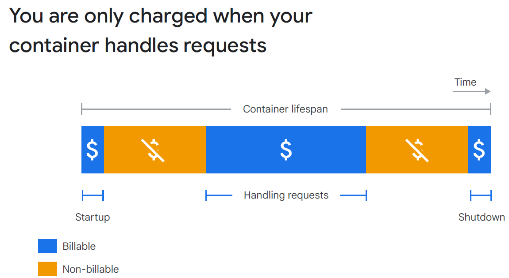
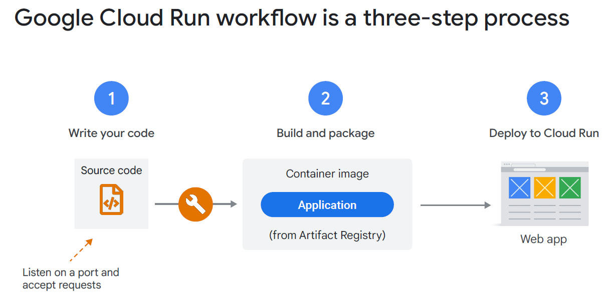
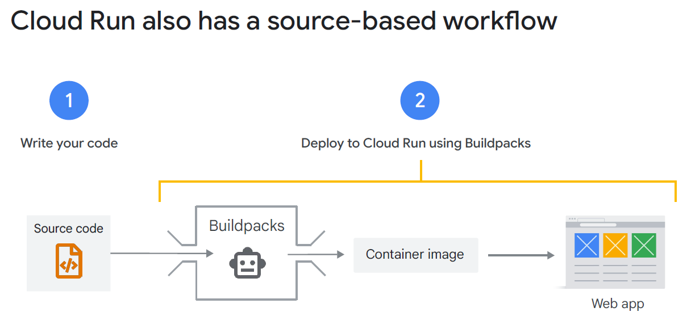
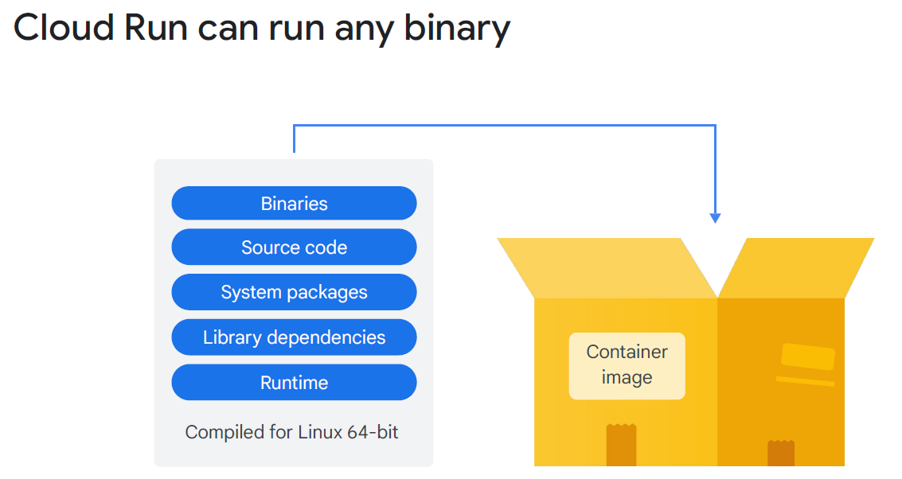
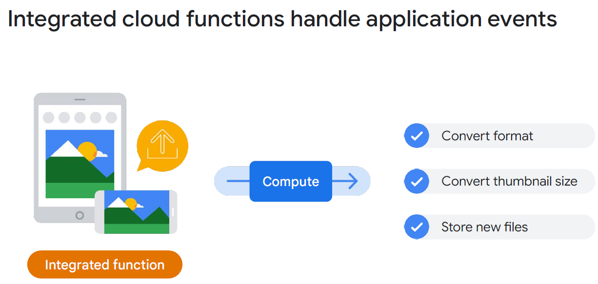

# Module 6: Serverless Applications

## Status: ✅ Completed (Day 2 · 2026.04.09)

## 🔗 Quick Navigation

- Q&A Review: [qa-review.md](qa-review.md)

---

## 📝 Learning Objectives

By the end of this module, you will understand:

- [x] What serverless means and its advantages over managing containers/VMs
- [x] Cloud Run's capabilities — stateless containerized workloads at scale
- [x] Two deployment options for Cloud Run (container image vs. source code)
- [x] Cloud Functions / Cloud Run Functions — event-driven serverless compute
- [x] The convergence of Cloud Functions into the Cloud Run platform
- [x] Artifact Registry — storing and managing container images
- [x] Buildpacks — how GCP builds container images from source code automatically

---

## 📚 Key Concepts

### 1. Serverless Computing

**Serverless** means **no server management** — the cloud provider handles all infrastructure provisioning, scaling, patching, and capacity planning. You provide code or containers; the provider handles everything else.

| Characteristic                   | Description                                                              |
|----------------------------------|--------------------------------------------------------------------------|
| **No infrastructure management** | No VMs to patch, no clusters to configure                                |
| **Automatic scaling**            | Scales from 0 to thousands of instances without configuration            |
| **Pay-per-use**                  | Charged only for requests processed and compute time consumed; idle = $0 |
| **High availability**            | Built-in; no separate configuration required                             |

**Serverless vs. Other Compute Models:**

| Model                  | You Manage               | Scale Control              | Cold Start          | Cost When Idle    |
|------------------------|--------------------------|----------------------------|---------------------|-------------------|
| IaaS (Compute Engine)  | VMs, OS, runtime, app    | Manual / autoscaling group | No cold start       | Pay per VM uptime |
| CaaS (GKE Standard)    | Cluster nodes, workloads | Kubernetes autoscaler      | No cold start       | Pay per node      |
| Serverless (Cloud Run) | Container or code        | Automatic, scale to zero   | Yes (first request) | Zero              |

---

### 2. Cloud Run

**Cloud Run** is Google Cloud's fully managed serverless platform for running **stateless containerized workloads**. It is built on **Knative**, an open API and runtime environment built on Kubernetes. Cloud Run can run on fully managed Google Cloud, on Google Kubernetes Engine, or anywhere Knative runs.

| Property            | Detail                                                                                                         |
|---------------------|----------------------------------------------------------------------------------------------------------------|
| **Runtime**         | Any language/framework packaged as a container                                                                 |
| **State**           | Stateless — no in-memory state between requests (externalize state to Firestore, Cloud SQL, Memorystore, etc.) |
| **Scaling**         | Automatic: 0 to thousands of instances; scales to zero when no traffic                                         |
| **Billing**         | Per **100ms** of CPU + memory while handling requests (including startup/shutdown); **no charges when idle**   |
| **Resource limits** | Up to **4 vCPUs and 8 GB of memory** per container                                                             |
| **Request fee**     | Small fee for every **one million requests** served                                                            |
| **Networking**      | HTTPS endpoint auto-generated; optionally private (VPC ingress)                                                |
| **Concurrency**     | Each instance can handle multiple concurrent requests (configurable)                                           |
| **Regions**         | Deployed to a GCP region; global reach via load balancer                                                       |



**Two Deployment Options:**

| Option                       | How                                                                             | When                                                   |
|------------------------------|---------------------------------------------------------------------------------|--------------------------------------------------------|
| **Deploy a container image** | Push image to Artifact Registry; Cloud Run runs it                              | Full control over the container image                  |
| **Deploy from source code**  | Point Cloud Run at your source directory; GCP builds the image using Buildpacks | No Dockerfile needed; convenient for standard runtimes |

**Cloud Run Workflow (Container Image):**
```
Write code → Create Dockerfile → Build image → Push to Artifact Registry → Deploy to Cloud Run
```



**Cloud Run Workflow (Source Code):**
```
Write code → gcloud run deploy --source . → Cloud Build + Buildpacks create image → Deploy to Cloud Run
```



**Cold Starts:**
- A "cold start" occurs when Cloud Run spins up a new instance to handle a request (after scaling to zero)
- First response may be slightly slower (typically < 1 second for most images)
- Minimize cold start time: keep images small, avoid heavy initialization at startup
- **Minimum instances** setting: Keep N instances warm to eliminate cold starts (at extra cost)

---

### 3. Artifact Registry

**Artifact Registry** is Google Cloud's managed service for storing, managing, and securing container images and other build artifacts.

| Feature                    | Detail                                                                              |
|----------------------------|-------------------------------------------------------------------------------------|
| **Formats**                | Docker container images, Maven packages, npm packages, Python packages, Helm charts |
| **Region**                 | Regional (images stored in specific region)                                         |
| **Integration**            | Cloud Build, Cloud Run, GKE, Cloud Deploy                                           |
| **Access control**         | IAM-controlled; grant image pull permissions to service accounts                    |
| **Vulnerability scanning** | Built-in Container Analysis scans images for known CVEs                             |

> **Note:** Artifact Registry replaced **Container Registry** as the recommended image storage service. New projects should use Artifact Registry.

---

### 4. Buildpacks

**Buildpacks** are an open-source tool that automatically detects the runtime (Node.js, Python, Java, Go, etc.) and builds a production-ready container image from source code — without a Dockerfile.

**How Buildpacks Work:**
1. Google Cloud detects the language/framework from your source code (e.g., `package.json` = Node.js)
2. Applies the appropriate builder image for that runtime
3. Installs dependencies, compiles if needed
4. Packages the application into a standard container image
5. Pushes the image to Artifact Registry

**Benefit:** Developers don't need Docker knowledge to containerize their applications when deploying to Cloud Run from source.



---

### 5. Cloud Functions (Cloud Run Functions)

**Cloud Functions** is Google Cloud's event-driven serverless compute platform. It is now integrated into the **Cloud Run ecosystem** and officially called **Cloud Run Functions**.

| Property          | Detail                                                                               |
|-------------------|--------------------------------------------------------------------------------------|
| **Trigger types** | HTTP requests, Cloud Storage events, Pub/Sub messages, Firestore events, 100+ more   |
| **Deployment**    | Source code only (no container image from user)                                      |
| **Languages**     | Node.js, Python, Go, Java, .NET, Ruby, PHP                                           |
| **Scaling**       | Automatic, independently per function                                                |
| **Billing**       | Per invocation + CPU/memory duration; free tier available                            |
| **Use case**      | Event-driven processing, lightweight API endpoints, webhooks, data pipeline triggers |

**Event Trigger Examples:**

| Event Source    | Example Trigger                                  |
|-----------------|--------------------------------------------------|
| Cloud Storage   | Run function when a file is uploaded to a bucket |
| Pub/Sub         | Process a message from a topic                   |
| Cloud Scheduler | Run function on a schedule (cron-like)           |
| HTTP            | Handle REST API requests                         |
| Firestore       | Trigger on document create/update/delete         |



**Cloud Functions vs. Cloud Run:**

| Feature                 | Cloud Functions                                  | Cloud Run                                       |
|-------------------------|--------------------------------------------------|-------------------------------------------------|
| **Deployment unit**     | Single function (source code)                    | Container (full app or microservice)            |
| **Deployment artifact** | Source code only                                 | Container image or source code                  |
| **Concurrency model**   | One request per instance (2nd gen: configurable) | Multiple concurrent requests per instance       |
| **Event-driven**        | Native; 100+ event trigger types                 | Requires manual Pub/Sub subscription setup      |
| **Complexity**          | Simpler for single-purpose triggers              | Better for complex apps with multiple endpoints |
| **Platform**            | Now built on Cloud Run infrastructure            | Cloud Run                                       |

**Convergence Note:** Cloud Functions 2nd generation runs **on top of Cloud Run**. Over time, both products are converging into a unified serverless platform. Cloud Run is becoming the single deployment target for both containerized workloads and event-driven functions.

---

### 6. Choosing the Right Serverless Option

```
Need to run a container with full control?
    → Cloud Run (deploy container image)

Have existing code, need quick deployment without Docker?
    → Cloud Run (deploy from source with Buildpacks)

Need to react to a cloud event (file upload, Pub/Sub, schedule)?
    → Cloud Functions (Cloud Run Functions)

Need Kubernetes but don't want to manage nodes?
    → GKE Autopilot
```

---

## 🔗 References & Links

| **Resource**                                                                                                                  | **Description**                                         |
|-------------------------------------------------------------------------------------------------------------------------------|---------------------------------------------------------|
| [Cloud Run Overview](https://cloud.google.com/run/docs/overview/what-is-cloud-run)                                            | What Cloud Run is, how it works, and when to use it     |
| [Cloud Run Pricing](https://cloud.google.com/run/pricing)                                                                     | Per 100ms billing breakdown: CPU, memory, and requests  |
| [Cloud Run vs Cloud Functions](https://cloud.google.com/blog/products/serverless/cloud-run-vs-cloud-functions-for-serverless) | Official comparison of when to use each                 |
| [Cloud Functions Overview](https://cloud.google.com/functions/docs/concepts/overview)                                         | Event-driven serverless functions (Cloud Run Functions) |
| [Artifact Registry](https://cloud.google.com/artifact-registry/docs/overview)                                                 | Store and manage container images                       |
| [Buildpacks on GCP](https://cloud.google.com/docs/buildpacks/overview)                                                        | Build containers from source without a Dockerfile       |
| [Knative](https://knative.dev/docs/)                                                                                          | Open-source platform Cloud Run is built on              |

---

## ❓ Key Questions to Review

- What does "serverless" mean in the context of Cloud Run?
- What are the three defining characteristics of a Cloud Run workload?
- What is the billing unit for Cloud Run and what phases are billed?
- What is a cold start and how can you mitigate it?
- What are the two ways to deploy to Cloud Run?
- What is a Buildpack and when would you use it over a Dockerfile?
- What is Artifact Registry and how does it differ from Docker Hub?
- What is the difference between Cloud Functions and Cloud Run?
- What are the maximum CPU and memory limits per Cloud Run container instance?
- Why is Cloud Run built on Knative significant for portability?
- When would you choose Cloud Run over GKE?
- When would you choose GKE over Cloud Run?

---

## 📌 Summary

| Concept           | Key Point                                                                        |
|-------------------|----------------------------------------------------------------------------------|
| Serverless        | No infra management; auto-scale to zero; pay per use                             |
| Cloud Run         | Managed containers; stateless; scale 0→∞; any language                           |
| Cloud Run billing | Per 100ms CPU + memory + requests; $0 at idle                                    |
| Deploy options    | Container image (Artifact Registry) OR source code (Buildpacks)                  |
| Cold starts       | First request after scale-to-zero is slightly slower; min-instances = warm       |
| Artifact Registry | Store container images; IAM-controlled; vulnerability scanning                   |
| Buildpacks        | Auto-build container from source code; no Dockerfile needed                      |
| Cloud Functions   | Event-driven; source code only; 100+ trigger types; now = Cloud Run Functions    |
| CF vs CR          | CF = event-triggered single functions; CR = full app containers with concurrency |
| Convergence       | Cloud Functions 2nd gen built on Cloud Run; converging platform                  |
